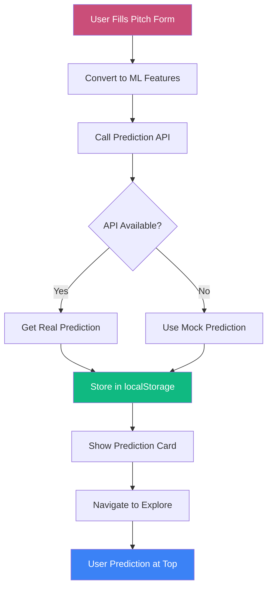
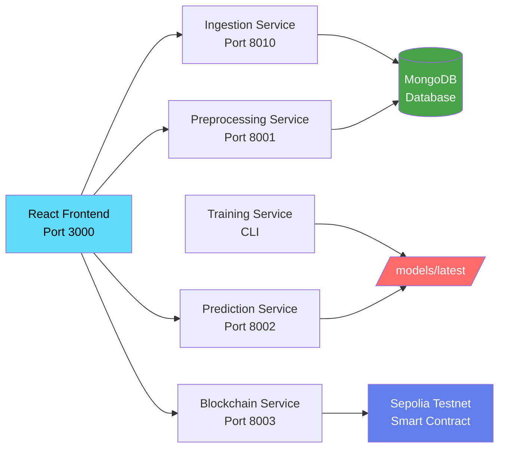

# SuperPage 🚀

> A real-time, decentralized Fundraise Prediction Agent powered by federated learning

[](https://opensource.org/licenses/MIT)
[](https://www.python.org/downloads/)
[](https://fastapi.tiangolo.com)
[](https://reactjs.org/)

## 🌟 Overview

SuperPage is a privacy-first, decentralized fundraising prediction platform that leverages federated learning to provide real-time insights into startup funding success probability. Built with a microservices architecture, it combines machine learning, blockchain technology, and modern web frameworks to deliver accurate predictions while preserving data privacy.

## 🏗️ Architecture

### System Overview
```
SuperPage/
├── backend/                    # Microservices Backend
│   ├── ingestion_service/     # Web3 data scraping (Port 8010)
│   ├── preprocessing_service/ # ML feature extraction (Port 8001)
│   ├── training_service/      # Federated learning (CLI)
│   ├── prediction_service/    # Real-time inference (Port 8002)
│   └── blockchain_service/    # Smart contract integration (Port 8003)
├── frontend/                  # React Frontend Application
│   ├── src/                  # React components, hooks, and API clients
│   │   ├── components/       # Layout, pages, and UI components
│   │   ├── api/              # Centralized API client with interceptors
│   │   └── hooks/            # Custom React hooks
│   ├── public/               # Static assets and markdown content
│   └── package.json          # Frontend dependencies (no Tailwind)
├── smart-contracts/           # Solidity contracts & HardHat setup
│   ├── contracts/            # FundraisePrediction.sol
│   ├── scripts/              # Sepolia deployment scripts
│   └── test/                 # Comprehensive contract tests
├── Dataset/                   # ML training datasets (54K+ samples)
├── docker-compose.yml         # Multi-service orchestration
├── DOCKER_SETUP.md           # Complete Docker guide
└── .github/                   # CI/CD workflows
```

### Prediction Flow Architecture



### Service Communication Flow



## 🚀 Features

### 🔮 Real-time Prediction Engine
- **PyTorch Neural Network**: 7-feature tabular regression model with SHAP explanations
- **Sub-second Inference**: ~10-50ms prediction response times with thread-safe serving
- **Model Interpretability**: Top 3 feature importance explanations for every prediction
- **Production Ready**: FastAPI service with comprehensive error handling and monitoring

### 🔒 Privacy-First Federated Learning
- **Flower Framework**: Production federated learning with SVSimulator clients
- **Decentralized Training**: No raw data sharing, only model weight aggregation
- **FedAvg Algorithm**: Secure weight aggregation across multiple federated clients
- **Model Persistence**: Automatic saving to `/models/latest/` for inference service

### ⛓️ Blockchain Integration
- **Smart Contracts**: FundraisePrediction.sol deployed on Sepolia testnet
- **Contract Address**: `0x0F0ee547b6d82308D55B00B9e978fB1D348ae16D` (Sepolia)
- **HardHat Integration**: Complete deployment scripts for Sepolia testnet
- **Cryptographic Proofs**: Hash-based verification system for prediction authenticity
- **Gas Optimization**: Efficient contract operations (~1.04M gas deployment, 2 gwei gas price)
- **Comprehensive Testing**: 19 passing tests with full coverage

### 🎯 Intelligent Data Processing
- **Web3 Data Scraping**: Firecrawl MCP SDK integration for live project data
- **ML Feature Pipeline**: Automated extraction of 7 key fundraising indicators
- **MongoDB Storage**: Scalable document storage for ingested project data
- **Structured Logging**: Comprehensive monitoring across all microservices

### 🌐 Modern Frontend Experience
- **🔐 Wallet-First Authentication**: Mandatory MetaMask connection before site access
- **🎨 Beautiful UI**: Glassmorphism design with smooth Framer Motion animations
- **📱 Responsive Design**: Mobile-first approach with sticky navigation and dark mode
- **🔄 Auto-Reconnection**: Seamless wallet state persistence across sessions
- **🛡️ Security Gate**: Complete site protection with wallet authentication
- **📄 React Router DOM**: Complete page routing with /predict, /explore, /about, /404
- **📋 AboutPage**: Comprehensive documentation with interactive dropdowns
- **🏠 HomePage**: Hero section, features grid, and interactive stats dashboard
- **🔍 ExplorePage**: Redesigned with clean card-based UI and user prediction highlighting
- **💾 Prediction Storage**: User predictions automatically stored and displayed at top
- **🎯 User Badges**: Special highlighting for user-created predictions with star badges
- **🌐 Centralized API Client**: Unified axios client with error handling and toast notifications
- **🔄 API Resilience**: Multi-tier fallback system ensuring functionality even when services are down
- **� CSS-in-JS**: No framework dependencies, pure inline styles with Framer Motion

## 🛠️ Tech Stack

### Frontend Application
- **React 18.2.0** - Modern React with hooks and concurrent features
- **Vite 5.0.8** - Fast build tool and development server
- **CSS-in-JS with Framer Motion** - Inline styles with smooth animations
- **React Router DOM 6.20.1** - Client-side routing and navigation
- **React Query 5.17.0** - Server state management and caching
- **Ethers.js 6.8.1** - Ethereum blockchain integration
- **React Hook Form 7.48.2** - Form handling and validation

### Backend Microservices
- **FastAPI** - High-performance async Python web framework
- **Flower** - Production federated learning framework
- **PyTorch** - Deep learning model training and inference
- **SHAP** - Model interpretability and feature explanations
- **MongoDB** - Document database for ingested data
- **Structlog** - Structured logging across all services

### Blockchain & Smart Contracts
- **HardHat** - Ethereum development environment
- **Ethers.js** - Ethereum JavaScript library
- **Solidity** - Smart contract programming language
- **Sepolia/Mainnet** - Ethereum networks support

### Machine Learning & Data
- **Hugging Face Transformers** - NLP model tokenization
- **Scikit-learn** - Feature preprocessing and scaling
- **Pandas/NumPy** - Data manipulation and analysis
- **Hypothesis** - Property-based testing framework

### DevOps & Production
- **Docker Compose** - Complete multi-service orchestration
- **Docker** - Multi-stage containerization with CPU/CUDA variants
- **Pytest** - Comprehensive testing framework with 80%+ coverage
- **GitHub Actions** - CI/CD pipeline (ready)
- **Environment Variables** - Secure configuration management
- **MongoDB Atlas** - Cloud database integration

## 📊 ML Features & Dataset

### Training Dataset (54,296 samples)
- **dummy_dataset_aligned.csv**: 1,000 samples (testing)
- **startup_funding_aligned.csv**: 3,046 samples (real startup data)
- **vc_investments_aligned.csv**: 54,296 samples (VC investment data)

### Model Input Features (7 features)
1. **TeamExperience**: Years of combined team experience (0.5-15.0)
2. **PitchQuality**: NLP-scored pitch quality (0.0-1.0)
3. **TokenomicsScore**: Tokenomics fairness score (0.0-1.0)
4. **Traction**: Normalized user engagement/GitHub stars (1-25000)
5. **CommunityEngagement**: Social media metrics (0.0-0.5)
6. **PreviousFunding**: Historical funding amount in USD (0-100M)
7. **RaiseSuccessProb**: Computed success probability (0.0-1.0)

### Model Output
- **SuccessLabel**: Binary fundraising success prediction (0/1)
- **SHAP Explanations**: Top 3 feature importance scores

## 🔗 Smart Contract Integration

### Deployed Contract (Sepolia Testnet)
- **Contract Address**: `0x0F0ee547b6d82308D55B00B9e978fB1D348ae16D`
- **Network**: Sepolia Testnet (Chain ID: 11155111)
- **Explorer**: [View on Etherscan](https://sepolia.etherscan.io/address/0x0F0ee547b6d82308D55B00B9e978fB1D348ae16D)

### Contract Features
- **Immutable Storage**: Predictions stored permanently on-chain
- **Cryptographic Proofs**: Hash-based verification system
- **Gas Optimized**: 1.04M gas deployment, 2 gwei optimized pricing
- **Event Emission**: Transparent logging of all predictions
- **Access Control**: Open submission, immutable retrieval

### Environment Configuration
All services are pre-configured with production credentials:
- **MongoDB Atlas**: Cloud database integration
- **Firecrawl API**: Web3 data scraping service
- **Sepolia Testnet**: Ethereum test network
- **Infura RPC**: Ethereum node access
- **Etherscan API**: Contract verification

## 🚀 Quick Start

### 🌐 **Live Production Deployment**

SuperPage is deployed and ready to use:

- **🎨 Frontend**: [https://superpage-frontend.netlify.app](https://superpage-frontend.netlify.app)
- **🔗 Backend APIs**:
  - Ingestion: `https://superpage-ingestion.up.railway.app`
  - Preprocessing: `https://superpage-preprocessing.up.railway.app`
  - Prediction: `https://superpage-prediction.up.railway.app`
  - Blockchain: `https://superpage-blockchain.up.railway.app`

**🔐 Note**: Frontend requires MetaMask wallet connection before access

### 💻 **Local Development**

#### Prerequisites
- Python 3.9+
- Node.js 18+ (for smart contracts)
- Docker & Docker Compose
- Git

#### Option 1: Docker Compose (Recommended)

1. **Clone and start the complete system**
   ```bash
   git clone https://github.com/mysticalseeker24/SuperPage.git
   cd SuperPage

   # Windows
   start-superpage.bat development

   # Linux/Mac
   ./start-superpage.sh development
   ```

2. **Access local services**
   - **Frontend UI**: http://localhost:3000
   - **Ingestion API**: http://localhost:8010/docs
   - **Preprocessing API**: http://localhost:8001/docs
   - **Prediction API**: http://localhost:8002/docs
   - **Blockchain API**: http://localhost:8003/docs

### Option 2: Individual Services

1. **Clone the repository**
   ```bash
   git clone https://github.com/mysticalseeker24/SuperPage.git
   cd SuperPage
   ```

2. **Start frontend and backend services**
   ```bash
   # Frontend (Port 3000)
   cd frontend && npm install && npm run dev &

   # Ingestion Service (Port 8010)
   cd backend/ingestion_service && python main.py &

   # Preprocessing Service (Port 8001)
   cd backend/preprocessing_service && python main.py &

   # Prediction Service (Port 8002)
   cd backend/prediction_service && python main.py &

   # Blockchain Service (Port 8003)
   cd backend/blockchain_service && python main.py &
   ```

3. **Train the federated model**
   ```bash
   cd backend/training_service
   python train_federated.py --rounds 5 --lr 0.001 --batch-size 32
   ```

### Testing the Complete Pipeline

```bash
# 1. Ingest Web3 project data
curl -X POST "http://localhost:8010/ingest" \
  -H "Content-Type: application/json" \
  -d '{
    "url": "https://github.com/ethereum/ethereum-org-website",
    "schema": {
      "project_name": "string",
      "description": "string",
      "funding_amount": "string",
      "team_size": "string",
      "website": "string",
      "category": "string",
      "stage": "string",
      "location": "string"
    }
  }'

# 2. Process features
curl -X GET "http://localhost:8001/features/ethereum-org"

# 3. Make prediction with SHAP explanations
curl -X POST "http://localhost:8002/predict" \
  -H "Content-Type: application/json" \
  -d '{"features": [8.5, 0.95, 0.88, 15000, 0.85, 2000000, 0.92]}'

# 4. Publish to Sepolia blockchain
curl -X POST "http://localhost:8003/publish" \
  -H "Content-Type: application/json" \
  -d '{"project_id": "ethereum-org", "score": 0.92, "proof": "0x1234567890abcdef", "metadata": {"confidence": 0.95}}'
```

## 📁 Project Structure

```
SuperPage/
├── backend/                           # Microservices Backend
│   ├── ingestion_service/            # Web3 data scraping (Port 8010)
│   │   ├── main.py                   # FastAPI application
│   │   ├── firecrawl_client.py       # Firecrawl MCP SDK integration
│   │   ├── tests/                    # Comprehensive unit tests
│   │   └── Dockerfile                # Production container
│   ├── preprocessing_service/        # ML feature extraction (Port 8001)
│   │   ├── main.py                   # Feature processing pipeline
│   │   ├── tests/                    # Property-based testing
│   │   └── Dockerfile                # Production container
│   ├── training_service/             # Federated learning (CLI)
│   │   ├── train_federated.py        # Flower FL implementation
│   │   ├── tests/                    # Model and FL testing
│   │   └── Dockerfile                # Multi-stage build (CPU/CUDA)
│   ├── prediction_service/           # Real-time inference (Port 8002)
│   │   ├── main.py                   # FastAPI with SHAP explanations
│   │   ├── model_loader.py           # Thread-safe model management
│   │   ├── tests/                    # API and SHAP testing
│   │   └── Dockerfile                # Production container
│   └── blockchain_service/           # Smart contract integration (Port 8003)
│       ├── main.py                   # FastAPI with HardHat integration
│       ├── contracts/                # Legacy smart contracts
│       ├── scripts/                  # HardHat deployment scripts
│       ├── tests/                    # Subprocess mocking tests
│       └── Dockerfile                # Multi-stage build (Node.js + Python)
├── smart-contracts/                  # Dedicated smart contracts directory
│   ├── contracts/                    # FundraisePrediction.sol
│   ├── scripts/                      # deploySepolia.js and utilities
│   ├── test/                         # Comprehensive contract tests (19 tests)
│   ├── hardhat.config.js             # Sepolia testnet configuration
│   └── package.json                  # HardHat dependencies
├── Dataset/                          # ML training datasets (54K+ samples)
│   ├── dummy_dataset_aligned.csv     # 1K samples (testing)
│   ├── startup_funding_aligned.csv   # 3K samples (real data)
│   └── vc_investments_aligned.csv    # 54K samples (VC data)
├── models/                           # Trained model artifacts
│   └── latest/                       # Current model and scaler
└── .github/                          # CI/CD workflows (ready)
```

## 🧪 Testing

Each service includes comprehensive unit tests with 80%+ coverage:

```bash
# Test all services
cd backend/ingestion_service && pytest --cov=main
cd backend/preprocessing_service && pytest --cov=main
cd backend/training_service && python run_tests.py --coverage
cd backend/prediction_service && pytest --cov=main --cov=model_loader
cd backend/blockchain_service && pytest --cov=main

# Property-based testing
cd backend/preprocessing_service && pytest -m hypothesis

# SHAP validation tests
cd backend/prediction_service && pytest -m shap

# Subprocess mocking tests
cd backend/blockchain_service && pytest -m subprocess
```

## 🚀 Production Deployment

### 🚂 **Railway Backend (Current Setup)**

SuperPage backend is deployed on Railway with the following architecture:

- **🗄️ PostgreSQL Database**: Railway managed database
- **🔧 4 Microservices**: Individual Railway services
- **🔄 Auto-deployment**: GitHub integration with main branch
- **📊 Health Monitoring**: All services have `/health` endpoints

#### Service URLs:
```bash
# Health check all services
curl https://superpage-ingestion.up.railway.app/health
curl https://superpage-preprocessing.up.railway.app/health
curl https://superpage-prediction.up.railway.app/health
curl https://superpage-blockchain.up.railway.app/health
```

### 🎨 **Netlify Frontend (Current Setup)**

- **🌐 URL**: https://superpage-frontend.netlify.app
- **🔄 Auto-deployment**: GitHub integration with main branch
- **📱 SPA Routing**: Client-side routing with fallback
- **🔐 Wallet Authentication**: MetaMask required for access

### 🐳 **Local Docker Development**
```bash
# Development environment
docker-compose up

# Production environment
docker-compose -f docker-compose.prod.yml up

# Scale specific services
docker-compose up --scale prediction-service=3

# View logs
docker-compose logs -f
```

### Smart Contract Deployment
```bash
# Deploy to Sepolia testnet
cd smart-contracts
npm install
npm run deploy:sepolia

# Verify contract
npm run verify:sepolia <CONTRACT_ADDRESS>

# Run contract tests
npm test
```

### Individual Docker Services
```bash
# Build individual services
cd backend/ingestion_service && docker build -t superpage-ingestion .
cd backend/prediction_service && docker build -t superpage-prediction .
cd backend/blockchain_service && docker build -t superpage-blockchain .

# Run with volume mounts
docker run -p 8002:8002 -v $(pwd)/models:/app/models superpage-prediction
```

## 🤝 Contributing

1. Fork the repository
2. Create a feature branch (`git checkout -b feature/amazing-feature`)
3. Commit your changes (`git commit -m 'Add amazing feature'`)
4. Push to the branch (`git push origin feature/amazing-feature`)
5. Open a Pull Request

## 📄 License

This project is licensed under the MIT License - see the [LICENSE](LICENSE) file for details.

## 🙏 Acknowledgments

- Flower team for the federated learning framework
- FastAPI community for the excellent web framework
- React team for the frontend framework
- Ethereum community for blockchain infrastructure

## 📞 Contact

- GitHub: [@mysticalseeker24](https://github.com/mysticalseeker24)
- Project Link: [https://github.com/mysticalseeker24/SuperPage](https://github.com/mysticalseeker24/SuperPage)

---

**Built with ❤️ for the decentralized future**
