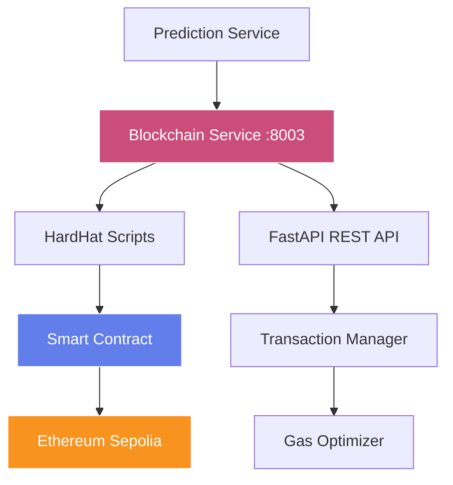

# SuperPage Blockchain Service

> Smart contract integration service for immutable on-chain prediction storage

[](https://fastapi.tiangolo.com/)
[](https://hardhat.org/)
[](https://soliditylang.org/)
[](https://www.docker.com/)

## 🎯 Overview

The SuperPage Blockchain Service provides secure on-chain publishing of prediction results using smart contracts on the Ethereum Sepolia testnet. It bridges Python FastAPI with HardHat/Ethers.js to enable transparent, immutable storage of fundraising predictions with cryptographic verification.

### 🏗️ Architecture



## ✨ Key Features

- **🔗 Smart Contract Integration**: Seamless Ethereum blockchain interaction
- **⛽ Gas Optimization**: Efficient transaction cost management
- **🔐 Secure Key Management**: Environment-based private key handling
- **📊 Transaction Monitoring**: Real-time status tracking and confirmations
- **🔄 Retry Logic**: Robust error handling with automatic retries
- **📈 Event Logging**: Comprehensive transaction and error logging
- **🐳 Docker Ready**: Production-ready containerization

## 🛠️ Tech Stack

| Component | Technology | Purpose |
|-----------|------------|---------|
| **API Framework** | FastAPI 0.104.1 | High-performance async REST API |
| **Blockchain** | HardHat 2.19.0 | Ethereum development environment |
| **Smart Contracts** | Solidity 0.8.19 | Contract development language |
| **Web3 Library** | Ethers.js 6.8.0 | Ethereum JavaScript library |
| **Process Bridge** | Subprocess | Python-to-Node.js communication |
| **Environment** | Python 3.11+ | Runtime environment |

## 📋 API Endpoints

### POST /publish
Publish a prediction result to the blockchain smart contract.

**Request:**
```json
{
  "project_id": "defi-protocol-xyz",
  "score": 0.7234,
  "proof": "0x1a2b3c4d5e6f7890abcdef1234567890abcdef1234567890abcdef1234567890",
  "metadata": {
    "model_version": "v1.0.0",
    "timestamp": "2024-01-15T10:30:00Z",
    "features_hash": "0xabcdef..."
  }
}
```

**Response:**
```json
{
  "success": true,
  "transaction_hash": "0xabc123...",
  "prediction_id": "pred_12345",
  "gas_used": 45678,
  "confirmation_time": 15.2,
  "etherscan_url": "https://sepolia.etherscan.io/tx/0xabc123..."
}
```

### GET /health
Service health check with blockchain connectivity status.

**Response:**
```json
{
  "status": "healthy",
  "blockchain_connected": true,
  "contract_address": "0x0F0ee547b6d82308D55B00B9e978fB1D348ae16D",
  "network": "sepolia",
  "block_number": 4567890,
  "service_uptime": "2h 30m 15s"
}
```

### GET /status/{transaction_hash}
Check the status of a blockchain transaction.

**Response:**
```json
{
  "status": "confirmed",
  "confirmations": 12,
  "block_number": 4567891,
  "gas_used": 45678,
  "gas_price": "20000000000",
  "success": true
}
```

## 🚀 Quick Start

### Prerequisites
- **Python 3.11+** with pip installed
- **Node.js 18+** and npm (for HardHat)
- **Ethereum Sepolia testnet ETH** for transactions
- **Private key** with testnet funds

### Local Development

1. **Clone and Navigate**
   ```bash
   git clone <repository-url>
   cd SuperPage/backend/blockchain_service
   ```

2. **Install Python Dependencies**
   ```bash
   pip install -r requirements.txt
   ```

3. **Install Node.js Dependencies**
   ```bash
   npm install
   ```

4. **Environment Configuration**
   ```bash
   # Create .env file
   cp .env.example .env
   
   # Edit with your configuration
   PRIVATE_KEY=your_sepolia_private_key_here
   CONTRACT_ADDRESS=0x0F0ee547b6d82308D55B00B9e978fB1D348ae16D
   SEPOLIA_RPC_URL=https://sepolia.infura.io/v3/YOUR_PROJECT_ID
   ```

5. **Start the Service**
   ```bash
   python main.py
   ```
   
   The service will be available at `http://localhost:8003`

### Docker Deployment

```bash
# Build and run with Docker
docker build -t superpage-blockchain .
docker run -p 8003:8003 --env-file .env superpage-blockchain

# Or use Docker Compose (recommended)
cd ../.. && docker-compose up blockchain_service
```

## ⚙️ Configuration

### Environment Variables

```bash
# Required
PRIVATE_KEY=your_sepolia_private_key_without_0x_prefix
CONTRACT_ADDRESS=0x0F0ee547b6d82308D55B00B9e978fB1D348ae16D

# Optional (with defaults)
SEPOLIA_RPC_URL=https://sepolia.infura.io/v3/YOUR_PROJECT_ID
PORT=8003
LOG_LEVEL=INFO
MAX_GAS_PRICE=50000000000  # 50 Gwei
GAS_LIMIT=100000
RETRY_ATTEMPTS=3
RETRY_DELAY=5
```

### HardHat Configuration

```javascript
// hardhat.config.js
module.exports = {
  solidity: "0.8.19",
  networks: {
    sepolia: {
      url: process.env.SEPOLIA_RPC_URL,
      accounts: [process.env.PRIVATE_KEY]
    }
  },
  gasReporter: {
    enabled: true,
    currency: 'USD'
  }
};
```

## 📜 Smart Contract

### Contract Interface

```solidity
// FundraisePrediction.sol
contract FundraisePrediction {
    struct Prediction {
        address submitter;
        uint8 score;
        uint256 timestamp;
        bytes proof;
    }
    
    mapping(bytes32 => Prediction) public predictions;
    uint256 public totalPredictions;
    
    function submitPrediction(
        bytes32 id,
        uint8 score,
        bytes calldata proof
    ) external;
    
    function getPrediction(bytes32 id) 
        external view returns (Prediction memory);
    
    function predictionExists(bytes32 id) 
        external view returns (bool);
}
```

### Contract Features

- **Gas Optimized**: Efficient storage patterns
- **Event Logging**: Comprehensive event emission
- **Access Control**: Secure submission validation
- **Data Integrity**: Immutable prediction storage

## 🔧 Development

### Running Tests

```bash
# Python tests
pytest tests/ -v

# HardHat tests
npx hardhat test

# Coverage reports
pytest --cov=. tests/
```

### Contract Deployment

```bash
# Deploy to Sepolia testnet
npx hardhat run scripts/deploy.js --network sepolia

# Verify contract on Etherscan
npx hardhat verify --network sepolia CONTRACT_ADDRESS
```

## 🐛 Troubleshooting

### Common Issues

**Private Key Issues**
```bash
# Ensure private key is without 0x prefix
PRIVATE_KEY=abc123...  # ✓ Correct
PRIVATE_KEY=0xabc123... # ✗ Incorrect
```

**Insufficient Funds**
```bash
# Check Sepolia ETH balance
curl -X POST -H "Content-Type: application/json" \
  --data '{"jsonrpc":"2.0","method":"eth_getBalance","params":["YOUR_ADDRESS","latest"],"id":1}' \
  https://sepolia.infura.io/v3/YOUR_PROJECT_ID
```

## 🤝 Contributing

1. Fork the repository
2. Create feature branch (`git checkout -b feature/blockchain-enhancement`)
3. Make changes and add tests
4. Run test suite (`pytest tests/`)
5. Commit changes (`git commit -m 'Add blockchain enhancement'`)
6. Push to branch (`git push origin feature/blockchain-enhancement`)
7. Open a Pull Request

## 📄 License

This project is licensed under the MIT License - see the [LICENSE](../../LICENSE) file for details.

---

**Built with ❤️ for Web3** | [Main Documentation](../../README.md) | [Smart Contract on Etherscan](https://sepolia.etherscan.io/address/0x0F0ee547b6d82308D55B00B9e978fB1D348ae16D)
