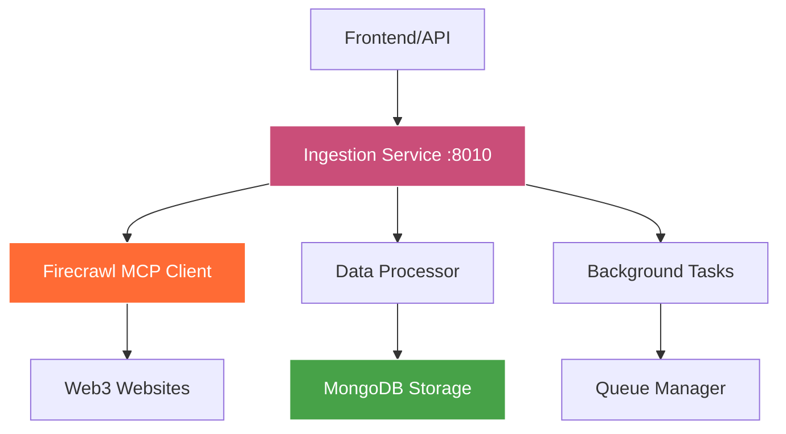

# SuperPage Ingestion Service

> Advanced web scraping service powered by Firecrawl MCP SDK for comprehensive Web3 data collection

[](https://fastapi.tiangolo.com/)
[](https://firecrawl.dev/)
[](https://www.mongodb.com/)
[](https://www.docker.com/)

## 🎯 Overview

The SuperPage Ingestion Service is a high-performance web scraping and data extraction service that continuously collects live Web3 startup data using the Firecrawl MCP (Model Context Protocol) SDK. It provides structured data extraction, intelligent parsing, and seamless integration with the SuperPage ML pipeline.

### 🏗️ Architecture



## ✨ Key Features

- **🔥 Firecrawl Integration**: Advanced web scraping with MCP SDK
- **📊 Structured Extraction**: Schema-based data validation and parsing
- **⚡ Async Processing**: High-performance concurrent web scraping
- **📝 Smart Parsing**: AI-powered content extraction and normalization
- **🗄️ MongoDB Storage**: Efficient document-based data persistence
- **🔄 Background Jobs**: Queue-based processing for scalability
- **📈 Rate Limiting**: Respectful scraping with configurable limits
- **🛡️ Error Handling**: Robust retry mechanisms and fallback strategies

## 🛠️ Tech Stack

| Component | Technology | Purpose |
|-----------|------------|---------|
| **API Framework** | FastAPI 0.104.1 | High-performance async REST API |
| **Web Scraping** | Firecrawl MCP SDK | Advanced web content extraction |
| **Database** | MongoDB 7.0 | Document-based data storage |
| **Background Tasks** | Celery + Redis | Async job processing |
| **HTTP Client** | HTTPX | Async HTTP requests |
| **Validation** | Pydantic 2.0+ | Data validation and serialization |
| **Environment** | Python 3.11+ | Runtime environment |

## 📋 API Endpoints

### POST /ingest
Initiate web scraping and data extraction for a given URL with custom schema.

**Request:**
```json
{
  "url": "https://example-web3-project.com",
  "schema": {
    "project_name": "string",
    "funding_amount": "number",
    "team_size": "number",
    "description": "string",
    "founding_date": "date",
    "category": "string",
    "location": "string"
  },
  "options": {
    "follow_links": true,
    "max_depth": 2,
    "wait_for": "networkidle",
    "extract_images": false
  }
}
```

**Response:**
```json
{
  "job_id": "ingest_12345",
  "status": "accepted",
  "message": "Ingestion job started successfully",
  "estimated_completion": "2024-01-15T10:35:00Z",
  "priority": "normal"
}
```

### GET /jobs/{job_id}
Retrieve the status and results of a specific ingestion job.

**Response:**
```json
{
  "job_id": "ingest_12345",
  "status": "completed",
  "progress": 100,
  "result": {
    "project_name": "DefiProtocol XYZ",
    "funding_amount": 2500000,
    "team_size": 12,
    "description": "Revolutionary DeFi lending protocol...",
    "founding_date": "2023-03-15",
    "category": "DeFi",
    "location": "San Francisco, CA"
  },
  "metadata": {
    "pages_scraped": 15,
    "processing_time": 45.2,
    "data_quality_score": 0.89,
    "extraction_confidence": 0.94
  },
  "completed_at": "2024-01-15T10:34:23Z"
}
```

### GET /health
Service health check with dependency status monitoring.

**Response:**
```json
{
  "status": "healthy",
  "firecrawl_connected": true,
  "mongodb_connected": true,
  "redis_connected": true,
  "active_jobs": 3,
  "completed_jobs_24h": 127,
  "service_uptime": "5h 23m 41s"
}
```

### GET /stats
Service performance and usage statistics.

**Response:**
```json
{
  "total_ingestions": 1247,
  "success_rate": 0.94,
  "average_processing_time": 32.5,
  "popular_domains": [
    "github.com",
    "medium.com",
    "coindesk.com"
  ],
  "daily_ingestions": 89,
  "queue_size": 12
}
```

## 🚀 Quick Start

### Prerequisites
- **Python 3.11+** with pip installed
- **MongoDB 7.0+** running locally or remotely
- **Redis** for background job queuing
- **Firecrawl API key** from [Firecrawl.dev](https://firecrawl.dev/)

### Local Development

1. **Clone and Navigate**
   ```bash
   git clone <repository-url>
   cd SuperPage/backend/ingestion_service
   ```

2. **Install Dependencies**
   ```bash
   pip install -r requirements.txt
   ```

3. **Environment Configuration**
   ```bash
   # Create .env file
   cp .env.example .env
   
   # Edit with your configuration
   FIRECRAWL_API_KEY=your_firecrawl_api_key_here
   MONGODB_URL=mongodb://localhost:27017/superpage
   REDIS_URL=redis://localhost:6379/0
   ```

4. **Start Dependencies**
   ```bash
   # Start MongoDB (if local)
   mongod
   
   # Start Redis (if local)
   redis-server
   ```

5. **Start the Service**
   ```bash
   python main.py
   ```
   
   The service will be available at `http://localhost:8010`

### Docker Deployment

```bash
# Build and run with Docker
docker build -t superpage-ingestion .
docker run -p 8010:8010 --env-file .env superpage-ingestion

# Or use Docker Compose (recommended)
cd ../.. && docker-compose up ingestion_service
```

## ⚙️ Configuration

### Environment Variables

```bash
# Required
FIRECRAWL_API_KEY=your_firecrawl_api_key_here
MONGODB_URL=mongodb://localhost:27017/superpage

# Optional (with defaults)
REDIS_URL=redis://localhost:6379/0
PORT=8010
LOG_LEVEL=INFO
MAX_CONCURRENT_JOBS=5
REQUEST_TIMEOUT=30
RETRY_ATTEMPTS=3
RATE_LIMIT_PER_MINUTE=60
```

### Firecrawl Configuration

```python
# firecrawl_client.py
firecrawl_config = {
    "api_key": os.getenv("FIRECRAWL_API_KEY"),
    "base_url": "https://api.firecrawl.dev/v0",
    "timeout": 30,
    "retries": 3,
    "rate_limit": 10  # requests per second
}
```

## 📁 Project Structure

```
ingestion_service/
├── firecrawl_client.py     # Firecrawl MCP SDK integration
├── main.py                 # FastAPI application
├── models/                 # Pydantic data models
│   ├── ingestion.py
│   └── schemas.py
├── services/              # Business logic
│   ├── data_processor.py
│   ├── extraction_engine.py
│   └── job_manager.py
├── database/              # MongoDB operations
│   ├── connection.py
│   └── repositories.py
├── utils/                 # Utility functions
│   ├── validators.py
│   └── helpers.py
├── tests/                 # Test suite
│   ├── test_ingestion.py
│   └── test_firecrawl.py
├── requirements.txt       # Python dependencies
├── Dockerfile            # Docker configuration
└── README.md             # This file
```

## 🔥 Firecrawl Integration

### MCP SDK Features

The service leverages Firecrawl's Model Context Protocol SDK for advanced web scraping:

```python
from firecrawl import FirecrawlApp

class FirecrawlClient:
    def __init__(self, api_key: str):
        self.app = FirecrawlApp(api_key=api_key)
    
    async def scrape_url(self, url: str, schema: dict):
        """Advanced scraping with schema-based extraction"""
        options = {
            'formats': ['markdown', 'html'],
            'headers': {'User-Agent': 'SuperPage-Bot/1.0'},
            'waitFor': 2000,
            'screenshot': True,
            'fullPageScreenshot': False
        }
        
        result = await self.app.scrape_url(
            url=url,
            params=options
        )
        
        # Apply schema-based extraction
        return self.extract_structured_data(result, schema)
```

### Supported Data Types

- **Text Content**: Paragraphs, headings, descriptions
- **Numerical Data**: Funding amounts, team sizes, metrics
- **Dates**: Founding dates, funding rounds, milestones
- **Lists**: Team members, investors, features
- **Links**: Social media, documentation, repositories
- **Images**: Logos, screenshots, diagrams

## 🔧 Development

### Running Tests

```bash
# Run all tests
pytest tests/ -v

# Run with coverage
pytest --cov=. tests/

# Run specific test categories
pytest tests/test_firecrawl.py -v
```

### Background Job Processing

```bash
# Start Celery worker for background jobs
celery -A main.celery worker --loglevel=info

# Monitor job queue
celery -A main.celery flower
```

### Database Operations

```python
# Example MongoDB operations
from database.repositories import IngestionRepository

repo = IngestionRepository()

# Store extracted data
await repo.store_ingestion_result(job_id, extracted_data)

# Query results
results = await repo.find_by_domain("github.com")
```

## 📊 Monitoring & Analytics

### Performance Metrics

- **Ingestion Rate**: Jobs processed per hour
- **Success Rate**: Percentage of successful extractions
- **Processing Time**: Average time per URL
- **Data Quality**: Extraction confidence scores
- **Error Tracking**: Failed requests and retry counts

### Health Monitoring

```python
# Health check implementation
async def check_dependencies():
    checks = {
        "firecrawl": await ping_firecrawl_api(),
        "mongodb": await check_mongodb_connection(),
        "redis": await check_redis_connection()
    }
    return all(checks.values())
```

## 🛡️ Data Quality & Validation

### Schema Validation

```python
from pydantic import BaseModel, validator

class ProjectSchema(BaseModel):
    project_name: str
    funding_amount: Optional[int]
    team_size: Optional[int]
    
    @validator('funding_amount')
    def validate_funding(cls, v):
        if v is not None and v < 0:
            raise ValueError('Funding amount must be positive')
        return v
```

### Quality Scoring

- **Completeness**: Percentage of schema fields extracted
- **Accuracy**: Validation against known data patterns
- **Confidence**: ML-based extraction confidence scores
- **Freshness**: Data recency and update frequency

## 🔍 Error Handling & Debugging

### Common Issues

**Firecrawl API Errors**
```python
try:
    result = await firecrawl_client.scrape_url(url, schema)
except FirecrawlError as e:
    logger.error(f"Firecrawl error: {e.message}")
    # Implement fallback strategy
```

**Rate Limiting**
```python
# Automatic rate limiting with exponential backoff
@rate_limit(calls=60, period=60)
async def scrape_with_rate_limit(url: str):
    return await firecrawl_client.scrape_url(url)
```

**Schema Mismatch**
```python
# Handle missing or invalid schema fields
def validate_extracted_data(data: dict, schema: dict):
    missing_fields = set(schema.keys()) - set(data.keys())
    if missing_fields:
        logger.warning(f"Missing fields: {missing_fields}")
    return data
```

## 🚀 Performance Optimization

### Concurrent Processing

```python
import asyncio
from concurrent.futures import ThreadPoolExecutor

async def process_urls_concurrently(urls: List[str]):
    semaphore = asyncio.Semaphore(MAX_CONCURRENT_JOBS)
    
    async def process_single_url(url):
        async with semaphore:
            return await scrape_and_process(url)
    
    results = await asyncio.gather(*[
        process_single_url(url) for url in urls
    ])
    return results
```

### Caching Strategy

- **Redis Caching**: Cache frequent URL results
- **Database Indexing**: Optimize MongoDB queries
- **Response Compression**: Reduce API response sizes
- **Connection Pooling**: Reuse HTTP connections

## 🐛 Troubleshooting

### Common Issues

**Firecrawl API Key Invalid**
```bash
# Check API key configuration
echo $FIRECRAWL_API_KEY

# Test API connection
curl -H "Authorization: Bearer $FIRECRAWL_API_KEY" \
  https://api.firecrawl.dev/v0/health
```

**MongoDB Connection Failed**
```bash
# Check MongoDB status
mongosh --eval "db.adminCommand('ping')"

# Verify connection string
echo $MONGODB_URL
```

**High Memory Usage**
```bash
# Monitor service memory usage
docker stats superpage-ingestion

# Adjust worker concurrency
CELERY_CONCURRENCY=2 celery worker
```

## 🤝 Contributing

1. Fork the repository
2. Create feature branch (`git checkout -b feature/ingestion-enhancement`)
3. Make changes and add tests
4. Run test suite (`pytest tests/`)
5. Check code quality (`flake8 . && black .`)
6. Commit changes (`git commit -m 'Add ingestion enhancement'`)
7. Push to branch (`git push origin feature/ingestion-enhancement`)
8. Open a Pull Request

## 📄 License

This project is licensed under the MIT License - see the [LICENSE](../../LICENSE) file for details.

---

**Powered by Firecrawl** | [Main Documentation](../../README.md) | [Firecrawl Documentation](https://docs.firecrawl.dev/)
