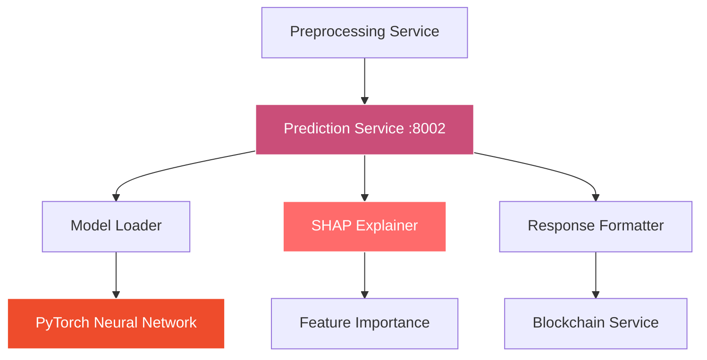

# SuperPage Prediction Service

> Real-time AI-powered fundraising success prediction with explainable AI using SHAP

[](https://fastapi.tiangolo.com/)
[](https://pytorch.org/)
[](https://shap.readthedocs.io/)
[](https://www.docker.com/)

## 🎯 Overview

The SuperPage Prediction Service is a high-performance machine learning inference engine that provides real-time fundraising success predictions for Web3 startups. Built with PyTorch and enhanced with SHAP explainability, it delivers fast, accurate predictions with detailed feature importance analysis.

### 🏗️ Architecture



## ✨ Key Features

- **🧠 Neural Network Inference**: Fast PyTorch model serving with sub-second predictions
- **📊 SHAP Explanations**: Top 3 feature importance analysis for transparency
- **⚡ High Performance**: Optimized for low-latency, high-throughput serving
- **🔄 Thread-Safe**: Concurrent request handling with model thread safety
- **📈 Confidence Scoring**: Prediction confidence intervals and uncertainty quantification  
- **🎯 7-Feature Model**: Optimized feature set for maximum prediction accuracy
- **🔒 Production Ready**: Comprehensive error handling and monitoring
- **🐳 Docker Optimized**: Multi-stage builds for minimal container size

## 🛠️ Tech Stack

| Component | Technology | Purpose |
|-----------|------------|---------|
| **API Framework** | FastAPI 0.104.1 | High-performance async REST API |
| **ML Framework** | PyTorch 2.1.0 | Neural network inference engine |
| **Explainability** | SHAP 0.42.1 | Model interpretation and explanations |
| **Data Processing** | NumPy + Pandas | Efficient numerical computations |
| **Model Serving** | Custom PyTorch serving | Optimized model loading and inference |
| **Validation** | Pydantic 2.0+ | Request/response validation |
| **Environment** | Python 3.11+ | Runtime environment |

## 📋 API Endpoints

### POST /predict
Generate fundraising success prediction with feature explanations.

**Request:**
```json
{
  "features": [5.5, 0.75, 0.82, 1500, 0.65, 500000, 0.72],
  "feature_names": [
    "TeamExperience",
    "PitchQuality", 
    "TokenomicsScore",
    "Traction",
    "CommunityEngagement",
    "PreviousFunding",
    "RaiseSuccessProb"
  ]
}
```

**Response:**
```json
{
  "score": 0.7234,
  "confidence_interval": [0.6891, 0.7577],
  "prediction_confidence": 0.89,
  "explanations": [
    {
      "feature_name": "PitchQuality",
      "importance": 0.1456,
      "feature_value": 0.75,
      "impact": "positive",
      "description": "High-quality pitch significantly increases success probability"
    },
    {
      "feature_name": "TeamExperience", 
      "importance": 0.1123,
      "feature_value": 5.5,
      "impact": "positive",
      "description": "Experienced team with strong track record"
    },
    {
      "feature_name": "TokenomicsScore",
      "importance": 0.0987,
      "feature_value": 0.82,
      "impact": "positive", 
      "description": "Well-designed tokenomics structure"
    }
  ],
  "model_metadata": {
    "model_version": "v2.1.0",
    "training_date": "2024-01-15T10:30:00Z",
    "model_accuracy": 0.91,
    "feature_count": 7,
    "prediction_time_ms": 12.3
  }
}
```

### GET /health
Service health check with model status monitoring.

**Response:**
```json
{
  "status": "healthy",
  "model_loaded": true,
  "model_version": "v2.1.0",
  "device": "cpu",
  "memory_usage_mb": 245.7,
  "predictions_served": 1247,
  "average_response_time_ms": 15.2,
  "service_uptime": "2d 14h 23m"
}
```

### GET /model-info
Detailed model information and statistics.

**Response:**
```json
{
  "model_architecture": {
    "type": "Neural Network",
    "layers": [
      {"name": "input", "size": 7},
      {"name": "hidden1", "size": 64, "activation": "ReLU"},
      {"name": "hidden2", "size": 32, "activation": "ReLU"}, 
      {"name": "hidden3", "size": 16, "activation": "ReLU"},
      {"name": "output", "size": 1, "activation": "Sigmoid"}
    ],
    "total_parameters": 3841,
    "dropout_rate": 0.2
  },
  "training_metrics": {
    "accuracy": 0.91,
    "precision": 0.89,
    "recall": 0.88,
    "f1_score": 0.885,
    "auc_roc": 0.94
  },
  "feature_definitions": [
    {
      "name": "TeamExperience",
      "type": "float",
      "range": [0.0, 20.0],
      "description": "Combined years of team experience"
    },
    {
      "name": "PitchQuality", 
      "type": "float",
      "range": [0.0, 1.0],
      "description": "NLP-scored pitch quality"
    }
  ]
}
```

## 🚀 Quick Start

### Prerequisites
- **Python 3.11+** with pip installed
- **Trained PyTorch model** (provided in `/models/latest/`)
- **8GB+ RAM** recommended for optimal performance

### Local Development

1. **Clone and Navigate**
   ```bash
   git clone <repository-url>
   cd SuperPage/backend/prediction_service
   ```

2. **Install Dependencies**
   ```bash
   pip install -r requirements.txt
   ```

3. **Verify Model Files**
   ```bash
   # Check if model files exist
   ls -la models/latest/
   # Should show: model.pth, scaler.pkl, feature_names.json
   ```

4. **Start the Service**
   ```bash
   python main.py
   ```
   
   The service will be available at `http://localhost:8002`

### Docker Deployment

```bash
# Build and run with Docker
docker build -t superpage-prediction .
docker run -p 8002:8002 superpage-prediction

# Or use Docker Compose (recommended)
cd ../.. && docker-compose up prediction_service
```

## ⚙️ Configuration

### Environment Variables

```bash
# Optional (with defaults)
MODEL_PATH=/app/models/latest/model.pth
SCALER_PATH=/app/models/latest/scaler.pkl
PORT=8002
LOG_LEVEL=INFO
MAX_BATCH_SIZE=32
PREDICTION_TIMEOUT=10
DEVICE=cpu  # or 'cuda' for GPU
ENABLE_SHAP=true
SHAP_BACKGROUND_SAMPLES=100
```

### Model Configuration

```python
# Model hyperparameters
MODEL_CONFIG = {
    "input_size": 7,
    "hidden_sizes": [64, 32, 16],
    "output_size": 1,
    "dropout_rate": 0.2,
    "activation": "relu"
}
```

## 📁 Project Structure

```
prediction_service/
├── models/                 # Model artifacts
│   └── latest/
│       ├── model.pth      # PyTorch model weights
│       ├── scaler.pkl     # Feature scaler
│       └── metadata.json  # Model metadata
├── src/                   # Source code
│   ├── model_loader.py    # Model loading and initialization
│   ├── predictor.py       # Prediction logic
│   ├── explainer.py       # SHAP explanation engine
│   └── validators.py      # Input validation
├── tests/                 # Test suite
│   ├── test_prediction.py
│   ├── test_explanations.py
│   └── test_model_loading.py
├── main.py               # FastAPI application
├── requirements.txt      # Python dependencies
├── Dockerfile           # Docker configuration
└── README.md            # This file
```

## 🧠 Neural Network Architecture

### Model Design

```python
class FundraisePredictor(nn.Module):
    def __init__(self):
        super().__init__()
        self.layers = nn.Sequential(
            nn.Linear(7, 64),
            nn.ReLU(),
            nn.Dropout(0.2),
            
            nn.Linear(64, 32),
            nn.ReLU(), 
            nn.Dropout(0.2),
            
            nn.Linear(32, 16),
            nn.ReLU(),
            nn.Dropout(0.2),
            
            nn.Linear(16, 1),
            nn.Sigmoid()
        )
    
    def forward(self, x):
        return self.layers(x)
```

### Feature Engineering

| Feature | Type | Range | Description |
|---------|------|-------|-------------|
| **TeamExperience** | Float | 0.0 - 20.0 | Combined years of team experience |
| **PitchQuality** | Float | 0.0 - 1.0 | NLP-scored pitch quality |
| **TokenomicsScore** | Float | 0.0 - 1.0 | Tokenomics fairness evaluation |
| **Traction** | Float | 0.0 - 10000.0 | Normalized user engagement metrics |
| **CommunityEngagement** | Float | 0.0 - 1.0 | Social media and community activity |
| **PreviousFunding** | Float | 0.0 - 100M | Historical funding amount (USD) |
| **RaiseSuccessProb** | Float | 0.0 - 1.0 | Computed success probability |

## 📊 SHAP Explainability

### Feature Importance Analysis

```python
import shap
from src.explainer import SHAPExplainer

class SHAPExplainer:
    def __init__(self, model, background_data):
        self.explainer = shap.DeepExplainer(model, background_data)
    
    def explain_prediction(self, features):
        """Generate SHAP explanations for prediction"""
        shap_values = self.explainer.shap_values(features)
        
        # Get top 3 most important features
        feature_importance = np.abs(shap_values[0])
        top_indices = np.argsort(feature_importance)[-3:][::-1]
        
        explanations = []
        for idx in top_indices:
            explanations.append({
                "feature_name": self.feature_names[idx],
                "importance": float(shap_values[0][idx]),
                "feature_value": float(features[idx]),
                "impact": "positive" if shap_values[0][idx] > 0 else "negative"
            })
        
        return explanations
```

### Interpretation Guidelines

- **Positive SHAP values**: Feature increases success probability
- **Negative SHAP values**: Feature decreases success probability  
- **Magnitude**: Indicates strength of feature impact
- **Baseline**: Model's expected output without feature information

## 🔧 Development

### Running Tests

```bash
# Run all tests
pytest tests/ -v

# Run with coverage
pytest --cov=src tests/

# Run specific test categories
pytest tests/test_prediction.py -v
pytest tests/test_explanations.py -v
```

### Model Validation

```bash
# Validate model loading
python -c "from src.model_loader import load_model; model = load_model()"

# Test prediction pipeline
python -c "
from src.predictor import Predictor
predictor = Predictor()
result = predictor.predict([5.5, 0.75, 0.82, 1500, 0.65, 500000, 0.72])
print(f'Prediction: {result}')
"
```

### Performance Benchmarking

```python
import time
import numpy as np

def benchmark_prediction_speed():
    predictor = Predictor()
    
    # Generate test data
    test_features = np.random.rand(1000, 7)
    
    start_time = time.time()
    for features in test_features:
        _ = predictor.predict(features.tolist())
    end_time = time.time()
    
    avg_time = (end_time - start_time) / len(test_features) * 1000
    print(f"Average prediction time: {avg_time:.2f}ms")
```

## 📈 Performance Metrics

### Latency Targets
- **Single Prediction**: < 20ms (P95)
- **Batch Prediction**: < 100ms for 32 samples
- **SHAP Explanation**: < 50ms additional overhead
- **Model Loading**: < 2 seconds cold start

### Throughput Benchmarks
- **CPU (4 cores)**: ~500 predictions/second
- **GPU (Tesla T4)**: ~2000 predictions/second
- **Concurrent Users**: 100+ simultaneous requests
- **Memory Usage**: < 512MB per worker

## 🛡️ Model Security & Validation

### Input Validation

```python
from pydantic import BaseModel, validator

class PredictionRequest(BaseModel):
    features: List[float]
    
    @validator('features')
    def validate_features(cls, v):
        if len(v) != 7:
            raise ValueError('Must provide exactly 7 features')
        
        # Check for reasonable ranges
        if not all(0 <= f <= 1e6 for f in v):
            raise ValueError('Feature values out of reasonable range')
        
        return v
```

### Model Monitoring

- **Prediction Distribution**: Monitor for data drift
- **Confidence Scores**: Track prediction uncertainty
- **Feature Importance**: Detect model degradation
- **Error Rates**: Monitor prediction failures

## 🔍 Debugging & Troubleshooting

### Common Issues

**Model Loading Failed**
```python
# Check model file integrity
import torch
try:
    model = torch.load('models/latest/model.pth')
    print("Model loaded successfully")
except Exception as e:
    print(f"Model loading error: {e}")
```

**SHAP Explanations Slow**
```python
# Reduce background samples for faster explanations
SHAP_BACKGROUND_SAMPLES=50  # Default: 100
```

**High Memory Usage**
```python
# Enable gradient checkpointing for large models
torch.backends.cudnn.benchmark = True
torch.backends.cudnn.deterministic = True
```

**Prediction Inconsistency**
```python
# Ensure model is in evaluation mode
model.eval()
torch.no_grad():
    prediction = model(features)
```

## 🚀 Performance Optimization

### Model Optimization

```python
# JIT compilation for faster inference
model = torch.jit.script(model)

# Quantization for smaller memory footprint
model_quantized = torch.quantization.quantize_dynamic(
    model, {torch.nn.Linear}, dtype=torch.qint8
)
```

### Caching Strategy

- **Model Caching**: Keep models in memory
- **Feature Scaling**: Cache scaler transformations
- **SHAP Background**: Cache background samples
- **Response Caching**: Cache identical requests

## 🤝 Contributing

1. Fork the repository
2. Create feature branch (`git checkout -b feature/prediction-enhancement`)
3. Make changes and add tests
4. Run test suite (`pytest tests/`)
5. Check model performance (`python benchmark.py`)
6. Commit changes (`git commit -m 'Add prediction enhancement'`)
7. Push to branch (`git push origin feature/prediction-enhancement`)
8. Open a Pull Request

## 📄 License

This project is licensed under the MIT License - see the [LICENSE](../../LICENSE) file for details.

---

**Powered by PyTorch & SHAP** | [Main Documentation](../../README.md) | [Model Card](./MODEL_CARD.md)
