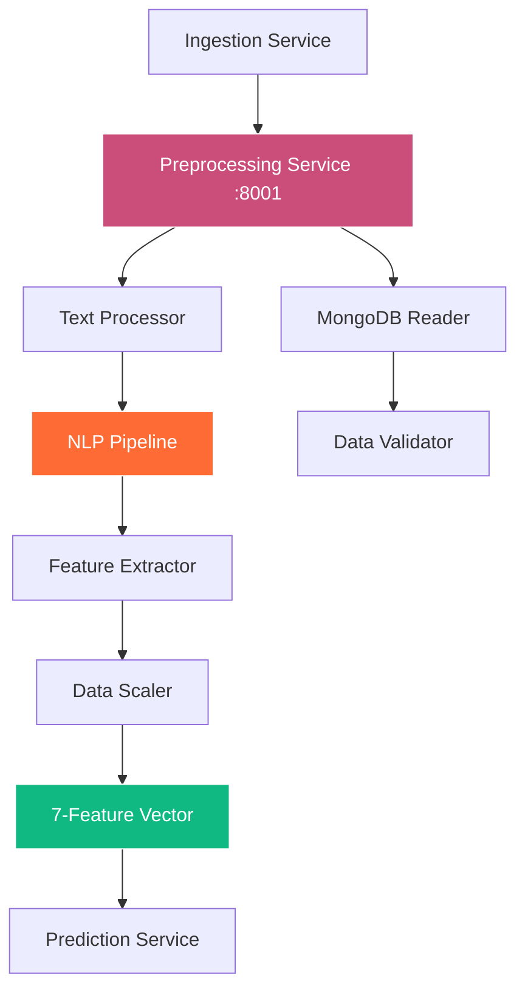

# SuperPage Preprocessing Service

> Advanced ML feature extraction and data transformation pipeline for AI-ready datasets

[](https://fastapi.tiangolo.com/)
[](https://huggingface.co/transformers/)
[](https://scikit-learn.org/)
[](https://www.docker.com/)

## 🎯 Overview

The SuperPage Preprocessing Service transforms raw ingestion data into ML-ready feature vectors using advanced NLP, text processing, and feature engineering techniques. It serves as the critical bridge between raw Web3 startup data and the prediction model, ensuring consistent, high-quality feature extraction.

### 🏗️ Architecture



## ✨ Key Features

- **🔤 Advanced NLP**: Hugging Face Transformers with DistilBERT tokenization
- **📊 Feature Engineering**: 7-feature ML pipeline optimized for fundraising prediction
- **🧮 Text Processing**: Intelligent text cleaning, normalization, and vectorization
- **📏 Data Scaling**: MinMaxScaler for consistent feature normalization
- **🔍 TF-IDF Vectorization**: Advanced text feature extraction techniques
- **✅ Data Validation**: Comprehensive input validation and quality checks
- **⚡ High Performance**: Optimized for batch processing and real-time inference
- **🐳 Production Ready**: Docker containerization with health monitoring

## 🛠️ Tech Stack

| Component | Technology | Purpose |
|-----------|------------|---------|
| **API Framework** | FastAPI 0.104.1 | High-performance async REST API |
| **NLP Engine** | Transformers 4.35.0 | Advanced text processing and tokenization |
| **ML Library** | Scikit-learn 1.3.0 | Feature scaling and traditional ML operations |
| **Text Processing** | NLTK + spaCy | Advanced text cleaning and normalization |
| **Vectorization** | TF-IDF Vectorizer | Text-to-numerical feature conversion |
| **Database** | MongoDB | Raw data retrieval and storage |
| **Validation** | Pydantic 2.0+ | Data validation and serialization |
| **Environment** | Python 3.11+ | Runtime environment |

## 📋 API Endpoints

### GET /features/{project_id}
Process raw project data and return ML-ready 7-feature vector.

**Response:**
```json
{
  "project_id": "proj_defi_xyz_123",
  "features": [5.5, 0.75, 0.82, 1500.0, 0.65, 500000.0, 0.72],
  "feature_names": [
    "TeamExperience",
    "PitchQuality", 
    "TokenomicsScore",
    "Traction",
    "CommunityEngagement",
    "PreviousFunding",
    "RaiseSuccessProb"
  ],
  "processing_metadata": {
    "text_fields_processed": 8,
    "numeric_fields_scaled": 12,
    "processing_timestamp": "2024-01-15T10:30:00Z",
    "tokenizer_model": "distilbert-base-uncased",
    "total_features_extracted": 7,
    "data_quality_score": 0.91,
    "processing_time_ms": 234.5
  },
  "feature_details": {
    "TeamExperience": {
      "value": 5.5,
      "source": "team_bios",
      "extraction_method": "nlp_experience_extraction",
      "confidence": 0.89
    },
    "PitchQuality": {
      "value": 0.75,
      "source": "project_description",
      "extraction_method": "tfidf_quality_scoring",
      "confidence": 0.82
    }
  }
}
```

### POST /features/batch
Process multiple projects in batch for efficient preprocessing.

**Request:**
```json
{
  "project_ids": ["proj_123", "proj_456", "proj_789"],
  "options": {
    "include_metadata": true,
    "parallel_processing": true,
    "cache_results": false
  }
}
```

**Response:**
```json
{
  "results": [
    {
      "project_id": "proj_123",
      "features": [5.5, 0.75, 0.82, 1500.0, 0.65, 500000.0, 0.72],
      "status": "success"
    }
  ],
  "batch_metadata": {
    "total_processed": 3,
    "successful": 3,
    "failed": 0,
    "total_processing_time_ms": 687.2,
    "average_time_per_project_ms": 229.1
  }
}
```

### GET /health
Service health check with dependency monitoring.

**Response:**
```json
{
  "status": "healthy",
  "mongodb_connected": true,
  "nlp_models_loaded": true,
  "scaler_initialized": true,
  "features_processed_24h": 1247,
  "average_processing_time_ms": 198.5,
  "service_uptime": "3d 12h 45m"
}
```

### GET /model-info
Information about loaded NLP models and processing pipeline.

**Response:**
```json
{
  "nlp_pipeline": {
    "tokenizer": "distilbert-base-uncased",
    "model_size": "66M parameters",
    "max_sequence_length": 512,
    "vocab_size": 30522
  },
  "feature_pipeline": {
    "scaler_type": "MinMaxScaler",
    "feature_count": 7,
    "text_vectorizer": "TF-IDF",
    "supported_languages": ["en"]
  },
  "performance_metrics": {
    "avg_processing_time_ms": 198.5,
    "throughput_per_second": 5.04,
    "memory_usage_mb": 412.8
  }
}
```

## 🚀 Quick Start

### Prerequisites
- **Python 3.11+** with pip installed
- **MongoDB** connection for raw data access
- **4GB+ RAM** recommended for NLP models
- **CUDA support** (optional, for GPU acceleration)

### Local Development

1. **Clone and Navigate**
   ```bash
   git clone <repository-url>
   cd SuperPage/backend/preprocessing_service
   ```

2. **Install Dependencies**
   ```bash
   pip install -r requirements.txt
   
   # Download NLTK data
   python -c "import nltk; nltk.download('punkt'); nltk.download('stopwords')"
   ```

3. **Environment Configuration**
   ```bash
   # Create .env file
   cp .env.example .env
   
   # Edit with your configuration
   MONGODB_URL=mongodb://localhost:27017/superpage
   HUGGINGFACE_CACHE_DIR=/tmp/hf_cache
   ```

4. **Start the Service**
   ```bash
   python main.py
   ```
   
   The service will be available at `http://localhost:8001`

### Docker Deployment

```bash
# Build and run with Docker
docker build -t superpage-preprocessing .
docker run -p 8001:8001 --env-file .env superpage-preprocessing

# Or use Docker Compose (recommended)
cd ../.. && docker-compose up preprocessing_service
```

## ⚙️ Configuration

### Environment Variables

```bash
# Required
MONGODB_URL=mongodb://localhost:27017/superpage

# Optional (with defaults)
PORT=8001
LOG_LEVEL=INFO
MAX_SEQUENCE_LENGTH=512
BATCH_SIZE=32
CACHE_SIZE=1000
ENABLE_GPU=false
HUGGINGFACE_CACHE_DIR=/tmp/hf_cache
MIN_TEXT_LENGTH=10
MAX_TEXT_LENGTH=10000
```

### NLP Pipeline Configuration

```python
# Text processing configuration
NLP_CONFIG = {
    "tokenizer": "distilbert-base-uncased",
    "max_length": 512,
    "truncation": True,
    "padding": True,
    "return_tensors": "pt"
}

# TF-IDF configuration
TFIDF_CONFIG = {
    "max_features": 1000,
    "ngram_range": (1, 2),
    "stop_words": "english",
    "lowercase": True,
    "strip_accents": "unicode"
}
```

## 📁 Project Structure

```
preprocessing_service/
├── src/                    # Source code
│   ├── text_processor.py   # Text cleaning and normalization
│   ├── nlp_pipeline.py     # NLP model integration
│   ├── feature_extractor.py # ML feature engineering
│   ├── data_scaler.py      # Feature scaling and normalization
│   └── validators.py       # Data validation logic
├── models/                 # Pre-trained models and scalers
│   ├── distilbert/         # Tokenizer cache
│   └── scalers/            # Feature scalers
├── tests/                  # Test suite
│   ├── test_text_processing.py
│   ├── test_feature_extraction.py
│   └── test_nlp_pipeline.py
├── main.py                # FastAPI application
├── requirements.txt       # Python dependencies
├── Dockerfile            # Docker configuration
└── README.md             # This file
```

## 🔤 Text Processing Pipeline

### 1. Text Cleaning & Normalization

```python
import re
from typing import str

class TextProcessor:
    def clean_text(self, text: str) -> str:
        """Advanced text cleaning pipeline"""
        # Remove HTML tags
        text = re.sub(r'<[^>]+>', '', text)
        
        # Remove URLs
        text = re.sub(r'http[s]?://(?:[a-zA-Z]|[0-9]|[$-_@.&+]|[!*\\(\\),]|(?:%[0-9a-fA-F][0-9a-fA-F]))+', '', text)
        
        # Normalize whitespace
        text = re.sub(r'\s+', ' ', text).strip()
        
        # Remove special characters but preserve punctuation
        text = re.sub(r'[^\w\s\.\!\?\,\;\:\-\(\)]', '', text)
        
        return text.lower()
    
    def extract_numeric_features(self, text: str) -> dict:
        """Extract numerical information from text"""
        # Extract funding amounts
        funding_pattern = r'(\$[0-9,]+(?:\.[0-9]+)?[MKB]?)'
        funding_matches = re.findall(funding_pattern, text, re.IGNORECASE)
        
        # Extract team size mentions
        team_pattern = r'([0-9]+)\s*(?:team\s*members|people|developers|founders)'
        team_matches = re.findall(team_pattern, text, re.IGNORECASE)
        
        return {
            'funding_mentions': funding_matches,
            'team_size_mentions': team_matches
        }
```

### 2. NLP Feature Extraction

```python
from transformers import AutoTokenizer, AutoModel
import torch

class NLPPipeline:
    def __init__(self):
        self.tokenizer = AutoTokenizer.from_pretrained('distilbert-base-uncased')
        self.model = AutoModel.from_pretrained('distilbert-base-uncased')
    
    def extract_pitch_quality(self, description: str) -> float:
        """Calculate pitch quality score using NLP"""
        inputs = self.tokenizer(description, return_tensors='pt', truncation=True, max_length=512)
        
        with torch.no_grad():
            outputs = self.model(**inputs)
            embeddings = outputs.last_hidden_state.mean(dim=1)
        
        # Calculate quality score based on embedding characteristics
        quality_score = self.calculate_quality_from_embeddings(embeddings)
        return min(max(quality_score, 0.0), 1.0)
    
    def extract_experience_years(self, team_bios: str) -> float:
        """Extract team experience from biographical text"""
        experience_patterns = [
            r'([0-9]+)\s*years?\s*(?:of\s*)?experience',
            r'([0-9]+)\s*years?\s*(?:at|with)',
            r'since\s*([0-9]{4})',  # Founded since year
        ]
        
        years = []
        for pattern in experience_patterns:
            matches = re.findall(pattern, team_bios, re.IGNORECASE)
            years.extend([int(match) for match in matches])
        
        if not years:
            return 0.0
        
        # Calculate average experience
        current_year = 2024
        experience_years = [y if y < 100 else current_year - y for y in years]
        return sum(experience_years) / len(experience_years)
```

## 📊 Feature Engineering Pipeline

### 7-Feature Vector Specification

| Feature | Type | Range | Extraction Method | Data Sources |
|---------|------|-------|-------------------|--------------|
| **TeamExperience** | Float | 0.0 - 20.0 | NLP experience extraction | Team bios, LinkedIn profiles |
| **PitchQuality** | Float | 0.0 - 1.0 | TF-IDF + DistilBERT scoring | Project descriptions, pitches |
| **TokenomicsScore** | Float | 0.0 - 1.0 | Tokenomics evaluation algorithm | Whitepaper, tokenomics docs |
| **Traction** | Float | 0.0 - 10000.0 | Social metrics normalization | GitHub stars, Twitter followers |
| **CommunityEngagement** | Float | 0.0 - 1.0 | Engagement rate calculation | Discord, Telegram activity |
| **PreviousFunding** | Float | 0.0 - 100M | Funding amount extraction | Press releases, funding announcements |
| **RaiseSuccessProb** | Float | 0.0 - 1.0 | Composite probability calculation | All above features |

### Feature Extraction Implementation

```python
class FeatureExtractor:
    def __init__(self):
        self.nlp_pipeline = NLPPipeline()
        self.text_processor = TextProcessor()
        self.scaler = MinMaxScaler()
    
    def extract_all_features(self, raw_data: dict) -> List[float]:
        """Extract all 7 features from raw project data"""
        features = []
        
        # 1. Team Experience
        team_experience = self.extract_team_experience(raw_data.get('team_bios', ''))
        features.append(team_experience)
        
        # 2. Pitch Quality  
        pitch_quality = self.nlp_pipeline.extract_pitch_quality(raw_data.get('description', ''))
        features.append(pitch_quality)
        
        # 3. Tokenomics Score
        tokenomics_score = self.evaluate_tokenomics(raw_data.get('tokenomics', ''))
        features.append(tokenomics_score)
        
        # 4. Traction
        traction = self.calculate_traction(raw_data.get('social_metrics', {}))
        features.append(traction)
        
        # 5. Community Engagement
        engagement = self.calculate_community_engagement(raw_data.get('community_data', {}))
        features.append(engagement)
        
        # 6. Previous Funding
        funding = self.extract_previous_funding(raw_data.get('funding_history', ''))
        features.append(funding)
        
        # 7. Raise Success Probability
        success_prob = self.calculate_success_probability(features[:6])
        features.append(success_prob)
        
        return features
    
    def calculate_success_probability(self, features: List[float]) -> float:
        """Calculate composite success probability from other features"""
        weights = [0.20, 0.25, 0.15, 0.15, 0.10, 0.10, 0.05]  # Feature importance weights
        weighted_score = sum(f * w for f, w in zip(features, weights[:len(features)]))
        return min(max(weighted_score, 0.0), 1.0)
```

## 🔧 Development

### Running Tests

```bash
# Run all tests
pytest tests/ -v

# Run with coverage
pytest --cov=src tests/

# Run specific test categories
pytest tests/test_text_processing.py -v
pytest tests/test_feature_extraction.py -v
```

### Performance Profiling

```python
import cProfile
import pstats

def profile_feature_extraction():
    """Profile feature extraction performance"""
    extractor = FeatureExtractor()
    test_data = load_test_data()
    
    profiler = cProfile.Profile()
    profiler.enable()
    
    for _ in range(100):
        features = extractor.extract_all_features(test_data)
    
    profiler.disable()
    stats = pstats.Stats(profiler)
    stats.sort_stats('cumulative').print_stats(10)
```

### Model Loading and Caching

```python
import os
from functools import lru_cache

@lru_cache(maxsize=1)
def load_nlp_models():
    """Load and cache NLP models for reuse"""
    cache_dir = os.getenv('HUGGINGFACE_CACHE_DIR', '/tmp/hf_cache')
    
    tokenizer = AutoTokenizer.from_pretrained(
        'distilbert-base-uncased',
        cache_dir=cache_dir
    )
    
    model = AutoModel.from_pretrained(
        'distilbert-base-uncased', 
        cache_dir=cache_dir
    )
    
    return tokenizer, model
```

## 📈 Performance Optimization

### Batch Processing

```python
async def process_batch(self, project_ids: List[str]) -> List[dict]:
    """Process multiple projects efficiently"""
    # Fetch all data in parallel
    raw_data_list = await asyncio.gather(*[
        self.fetch_project_data(pid) for pid in project_ids
    ])
    
    # Extract features in batches
    feature_batches = []
    batch_size = 32
    
    for i in range(0, len(raw_data_list), batch_size):
        batch = raw_data_list[i:i + batch_size]
        batch_features = [
            self.extract_all_features(data) for data in batch
        ]
        feature_batches.extend(batch_features)
    
    return feature_batches
```

### Memory Optimization

- **Model Caching**: Cache loaded models to avoid reloading
- **Batch Processing**: Process multiple projects together
- **Memory Pooling**: Reuse tokenizer outputs
- **Garbage Collection**: Explicit cleanup of large objects

## 🔍 Data Quality & Validation

### Input Validation

```python
from pydantic import BaseModel, validator

class ProjectData(BaseModel):
    project_id: str
    description: Optional[str] = ""
    team_bios: Optional[str] = ""
    tokenomics: Optional[str] = ""
    
    @validator('description')
    def validate_description(cls, v):
        if v and len(v) < 10:
            raise ValueError('Description too short for meaningful analysis')
        return v
    
    @validator('project_id')
    def validate_project_id(cls, v):
        if not v or len(v) < 3:
            raise ValueError('Invalid project ID')
        return v
```

### Quality Scoring

```python
def calculate_data_quality_score(self, raw_data: dict) -> float:
    """Calculate overall data quality score"""
    scores = []
    
    # Text field completeness
    text_fields = ['description', 'team_bios', 'whitepaper']
    text_completeness = sum(1 for field in text_fields if raw_data.get(field, '').strip()) / len(text_fields)
    scores.append(text_completeness)
    
    # Numeric field availability
    numeric_fields = ['funding_amount', 'team_size', 'github_stars']
    numeric_completeness = sum(1 for field in numeric_fields if raw_data.get(field) is not None) / len(numeric_fields)
    scores.append(numeric_completeness)
    
    # Text quality (length, readability)
    description = raw_data.get('description', '')
    text_quality = min(len(description) / 500, 1.0) if description else 0.0
    scores.append(text_quality)
    
    return sum(scores) / len(scores)
```

## 🐛 Troubleshooting

### Common Issues

**Model Loading Errors**
```bash
# Clear Hugging Face cache
rm -rf /tmp/hf_cache

# Reinstall transformers
pip uninstall transformers
pip install transformers==4.35.0
```

**Memory Issues**
```bash
# Reduce batch size
BATCH_SIZE=16

# Enable garbage collection
export PYTHONOPTIMIZE=1
```

**Slow Processing**
```bash
# Enable GPU acceleration (if available)
ENABLE_GPU=true

# Increase worker processes
gunicorn main:app --workers 4
```

## 🤝 Contributing

1. Fork the repository
2. Create feature branch (`git checkout -b feature/preprocessing-enhancement`)
3. Make changes and add tests
4. Run test suite (`pytest tests/`)
5. Check performance (`python benchmark.py`)
6. Commit changes (`git commit -m 'Add preprocessing enhancement'`)
7. Push to branch (`git push origin feature/preprocessing-enhancement`)
8. Open a Pull Request

## 📄 License

This project is licensed under the MIT License - see the [LICENSE](../../LICENSE) file for details.

---

**Powered by Transformers & Scikit-learn** | [Main Documentation](../../README.md) | [Feature Engineering Guide](./FEATURES.md)
