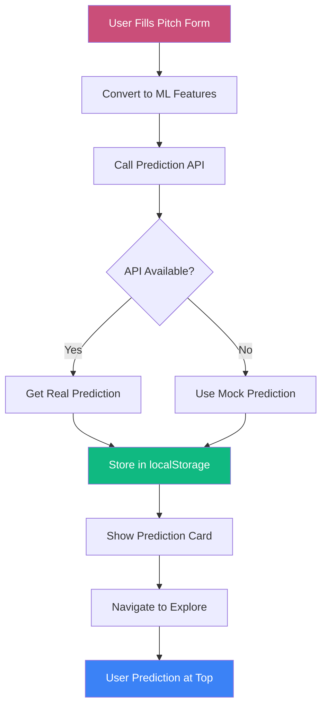
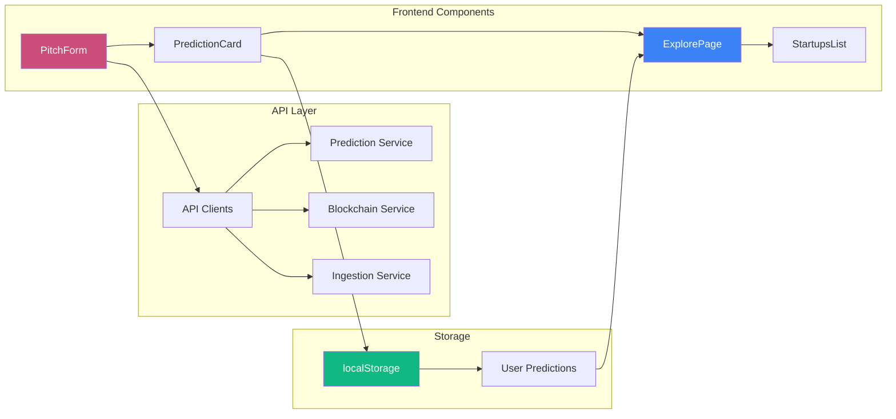

# SuperPage Frontend

> Modern React frontend for SuperPage - Real-time Decentralized Fundraise Prediction Agent

[](https://reactjs.org/)
[](https://vitejs.dev/)
[](https://reactrouter.com/)
[](https://www.framer.com/motion/)

## 🌟 Overview

The SuperPage frontend is a modern, responsive React application that provides an intuitive interface for Web3 fundraising prediction. Built with OnlyFounders-inspired design principles using CSS-in-JS and Framer Motion, it features clean aesthetics, generous whitespace, and smooth animations without any CSS framework dependencies.

### ✨ **Latest Features Added**
- **🧭 React Router DOM**: Complete page routing with /predict, /explore, /about, /404
- **📄 AboutPage**: Markdown-rendered documentation with scroll animations
- **🏠 HomePage**: Hero section, features grid, and stats dashboard
- **🔍 ExplorePage**: Completely redesigned with clean card-based UI
- **💾 Prediction Storage**: User predictions stored and displayed prominently
- **🎨 Glassmorphism Design**: Beautiful card layouts with backdrop blur
- **🌐 Centralized API Client**: Unified axios client with error handling
- **🎯 User Prediction Badges**: Special highlighting for user-created predictions
- **📱 Responsive Grid**: Auto-fit card layout for all screen sizes
- **🔄 API Resilience**: Multi-tier fallback system with mock data support

## 🎨 Design System

### Color Palette
- **Primary**: `#CA4E79` (OnlyFounders pink)
- **Dark Background**: `#0F0E13` (Deep dark)
- **Surface Dark**: `#1D1C24` (Card background)
- **Light Background**: `#FFFFFF` (Clean white)

### Typography
- **Primary Font**: Inter (system-ui fallback)
- **Monospace**: JetBrains Mono

### Components
- **Glass Morphism**: Backdrop blur effects
- **Smooth Animations**: Framer Motion transitions
- **Responsive Design**: Mobile-first approach
- **Dark/Light Mode**: System preference + manual toggle

## 🚀 Features

### 🔐 Wallet-First Authentication
- **Mandatory MetaMask**: Required wallet connection before site access
- **Auto-Detection**: Checks for existing wallet connections
- **Network Detection**: Auto-switch to Sepolia testnet
- **Connection Persistence**: Remember wallet state across sessions
- **Security Gate**: Complete site protection with wallet authentication
- **Error Handling**: Comprehensive error messages and installation prompts

### 📊 Prediction Interface
- **Interactive Form**: 7-feature input matching ML model
- **Real-time Validation**: React Hook Form validation
- **Slider Controls**: Intuitive range inputs
- **Progress Indicators**: Visual feedback during processing

### 🤖 AI Predictions
- **SHAP Explanations**: Top 3 feature importance display
- **Success Probability**: Visual percentage with progress bar
- **Feature Analysis**: Detailed breakdown of contributing factors
- **Confidence Indicators**: Model certainty visualization

### ⛓️ Blockchain Publishing
- **Smart Contract Integration**: Publish predictions to Sepolia
- **Transaction Tracking**: Etherscan links for verification
- **Cryptographic Proofs**: Hash-based authenticity
- **Gas Optimization**: Efficient contract interactions

### 🔍 Service Monitoring
- **Real-time Health Checks**: Monitor all backend services
- **Status Dashboard**: Visual service status indicators
- **Auto-refresh**: 30-second health check intervals
- **Error Reporting**: Detailed error messages

## 🛠️ Tech Stack

### Core Framework
- **React 18.2.0** - Modern React with hooks
- **Vite 5.0.8** - Fast build tool and dev server
- **React Query 3.39.3** - Server state management
- **React Hook Form 7.48.2** - Form handling and validation

### Styling & Animation
- **CSS-in-JS** - Inline styles with JavaScript objects
- **Framer Motion 10.16.16** - Animation library and smooth transitions
- **Lucide React 0.294.0** - Beautiful icons
- **Custom CSS** - Clean animations and responsive design

### Web3 Integration
- **Ethers.js 6.8.1** - Ethereum library
- **MetaMask Detection** - Wallet connection handling
- **Network Switching** - Sepolia testnet support

### Development Tools
- **ESLint** - Code linting
- **TypeScript Support** - Type checking (optional)

## 📁 Project Structure

```
frontend/
├── public/                 # Static assets
│   └── about.md           # About page markdown content
├── src/
│   ├── components/        # React components
│   │   ├── Layout.jsx         # Main layout with navigation
│   │   ├── Router.jsx         # React Router configuration
│   │   ├── HomePage.jsx       # Landing page with hero section
│   │   ├── PredictPage.jsx    # Prediction interface page
│   │   ├── ExplorePage.jsx    # Community predictions page
│   │   ├── AboutPage.jsx      # About page with markdown
│   │   ├── NotFoundPage.jsx   # 404 error page
│   │   ├── WalletConnect.jsx  # Wallet connection UI
│   │   ├── PitchForm.jsx      # Prediction form
│   │   ├── PredictionCard.jsx # Results display
│   │   ├── StartupsList.jsx   # Community predictions list
│   │   └── ServiceStatus.jsx  # Health monitoring
│   ├── hooks/            # Custom React hooks
│   │   └── useWallet.js       # Wallet connection logic
│   ├── services/         # API integration
│   │   └── api.js            # Backend service calls
│   ├── api/              # Centralized API client
│   │   └── clients.js        # Axios client with interceptors
│   ├── App.jsx          # Root component with React Query
│   ├── main.jsx         # React entry point
│   └── index.css        # Global styles (no Tailwind)
├── package.json         # Dependencies
├── vite.config.js      # Vite configuration
├── .eslintrc.cjs      # ESLint configuration
└── README.md           # This file
```

## 🚀 Quick Start

### Prerequisites
- Node.js 18+ and npm 9+
- MetaMask browser extension
- SuperPage backend services running

### Installation

1. **Install dependencies**
   ```bash
   cd frontend
   npm install
   ```

2. **Start development server**
   ```bash
   npm run dev
   ```

3. **Access the application**
   - Frontend: http://localhost:3000
   - Backend APIs proxied through Vite

### Backend Integration

The frontend automatically proxies API calls to backend services:
- `/api/ingestion` → `http://localhost:8010`
- `/api/preprocessing` → `http://localhost:8001`
- `/api/prediction` → `http://localhost:8002`
- `/api/blockchain` → `http://localhost:8003`

## 🔧 Configuration

### Environment Variables
Create `.env.local` for custom configuration:

```env
# API URLs (optional - defaults to localhost)
VITE_INGESTION_API_URL=http://localhost:8010
VITE_PREPROCESSING_API_URL=http://localhost:8001
VITE_PREDICTION_API_URL=http://localhost:8002
VITE_BLOCKCHAIN_API_URL=http://localhost:8003

# Blockchain Configuration
VITE_SEPOLIA_RPC_URL=https://sepolia.infura.io/v3/YOUR_PROJECT_ID
VITE_CONTRACT_ADDRESS=0x0F0ee547b6d82308D55B00B9e978fB1D348ae16D
```

### Styling Customization
Modify the styles object in components to customize the design system:

```javascript
// Example: Update colors in any component
const styles = {
  primary: '#CA4E79', // OnlyFounders pink
  background: '#0F0E13', // Dark background
  surface: '#1D1C24', // Card background
}
```


## 🏗️ Build & Deploy

### Development Build
```bash
npm run build
npm run preview
```

### Production Build
```bash
# Build for production
npm run build

# Serve built files
npm run preview
```

### Docker Deployment
```bash
# Build Docker image
docker build -t superpage-frontend .

# Run container
docker run -p 3000:3000 superpage-frontend
```

## 🔗 API Integration

### Prediction Flow Architecture



### Frontend-Backend Communication



### Detailed Prediction Flow
1. **Form Input**: User fills out pitch form (7 features)
2. **Feature Conversion**: Form data converted to ML feature vector
3. **API Call**: POST to `/api/prediction/predict` with fallback
4. **Storage**: Prediction stored in localStorage for persistence
5. **Display**: Results shown with SHAP explanations
6. **Explore Integration**: User predictions appear at top of Explore page
7. **Optional**: Publish to blockchain via smart contract

### Feature Mapping
The frontend converts form inputs to ML features:
- **Team Experience** → `TeamExperience` (0.5-15.0 years)
- **Pitch Description** → `PitchQuality` (0.0-1.0 NLP score)
- **Tokenomics URL** → `TokenomicsScore` (0.0-1.0 validity score)
- **Traction** → `Traction` (1-25000 normalized)
- **Community Engagement** → `CommunityEngagement` (0.0-0.5)
- **Previous Funding** → `PreviousFunding` (0-100M USD)
- **Calculated** → `RaiseSuccessProb` (0.0-1.0 computed)

### API Resilience Strategy
```javascript
// Multi-tier fallback system
try {
  // 1. Direct service call
  const response = await fetch('http://localhost:8002/predict')
  if (response.ok) return await response.json()

  // 2. Proxy endpoint fallback
  const proxyResponse = await apiClient.post('/api/prediction/predict')
  return proxyResponse.data
} catch (error) {
  // 3. Mock data for development
  return generateMockPrediction()
}
```

## 🎯 User Experience

### Wallet Connection Flow
1. **Landing**: Prompt to connect MetaMask
2. **Installation**: Guide to install MetaMask if missing
3. **Network**: Auto-switch to Sepolia testnet
4. **Persistence**: Remember connection state

### Prediction Flow
1. **Form**: Intuitive 7-feature input form
2. **Validation**: Real-time form validation
3. **Processing**: Loading states with animations
4. **Results**: Visual prediction with explanations
5. **Blockchain**: Optional on-chain publishing

### Responsive Design
- **Mobile**: Touch-friendly controls
- **Tablet**: Optimized layouts
- **Desktop**: Full feature experience
- **Dark Mode**: System preference detection

## 🤝 Contributing

1. Fork the repository
2. Create a feature branch (`git checkout -b feature/amazing-feature`)
3. Commit your changes (`git commit -m 'Add amazing feature'`)
4. Push to the branch (`git push origin feature/amazing-feature`)
5. Open a Pull Request

## 📄 License

This project is licensed under the MIT License - see the [LICENSE](../LICENSE) file for details.

---

**Built with ❤️ for the decentralized future**
