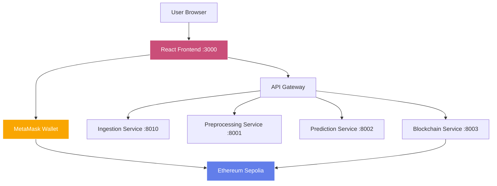
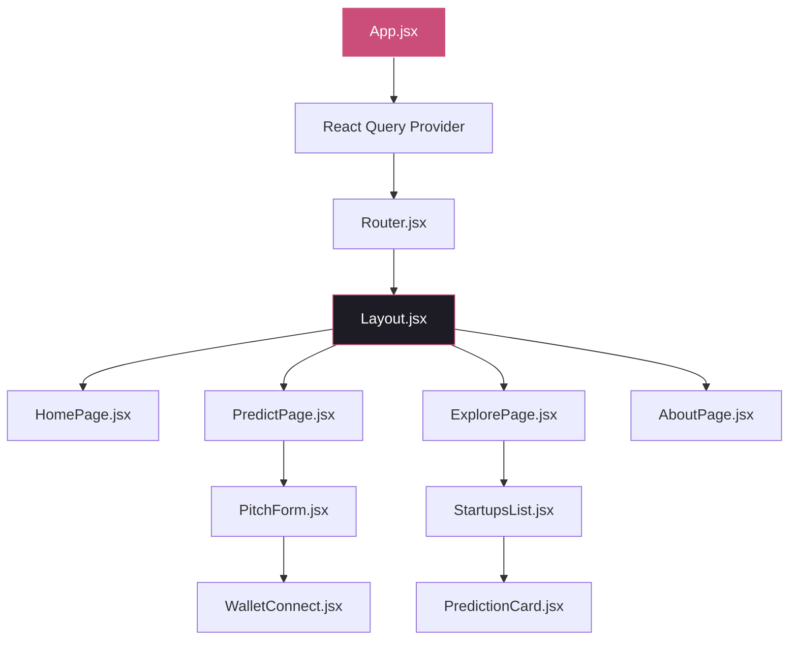
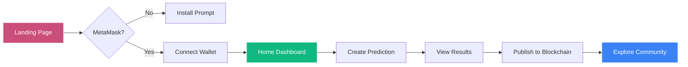

# SuperPage Frontend

> Modern React frontend for SuperPage - AI-Powered Web3 Fundraising Prediction Platform

[](https://reactjs.org/)
[](https://vitejs.dev/)
[](https://www.typescriptlang.org/)
[](https://www.docker.com/)

## 🎯 Overview

The SuperPage frontend is a cutting-edge React application that provides an intuitive and secure interface for Web3 fundraising prediction. Built with modern design principles and mandatory MetaMask wallet authentication, it delivers a seamless user experience for AI-powered fundraising analysis.

### 🏗️ Architecture



### ✨ Key Features

- **🔐 Mandatory Wallet Authentication**: MetaMask connection required for platform access
- **🎨 Modern UI/UX**: Glassmorphism design with smooth Framer Motion animations
- **📱 Responsive Design**: Mobile-first approach with adaptive layouts
- **🌙 Dark/Light Modes**: System preference detection with manual override
- **⚡ Real-time API Integration**: Seamless backend service communication
- **🎯 Smart Navigation**: Automatic redirects and intelligent routing
- **📊 Interactive Predictions**: Dynamic form validation and result display
- **🔄 State Management**: Efficient React Query v5 implementation

## 🛠️ Tech Stack

| Category | Technology | Purpose |
|----------|------------|---------|
| **Framework** | React 18.2.0 | Component-based UI framework |
| **Build Tool** | Vite 5.0.8 | Fast development and build system |
| **Routing** | React Router 6.20.1 | Client-side navigation |
| **Animation** | Framer Motion 10.16.16 | Smooth animations and transitions |
| **State Management** | React Query v5 | Server state management |
| **Web3 Integration** | Ethers.js | Ethereum blockchain interaction |
| **Styling** | CSS-in-JS | Component-scoped styling |
| **HTTP Client** | Axios | API communication |
| **Development** | ESLint + Prettier | Code quality and formatting |

## 🚀 Quick Start

### Prerequisites
- **Node.js 18+** and **npm 9+**
- **MetaMask** browser extension installed
- **SuperPage backend services** running (via Docker Compose)

### Local Development

1. **Clone and Navigate**
   ```bash
   git clone <repository-url>
   cd SuperPage/frontend
   ```

2. **Install Dependencies**
   ```bash
   npm install
   ```

3. **Environment Setup**
   ```bash
   # Create .env file (optional - uses defaults)
   cp .env.example .env
   ```

4. **Start Development Server**
   ```bash
   npm run dev
   ```
   
   The application will be available at `http://localhost:3000`

### Docker Deployment

```bash
# Build and run with Docker
docker build -t superpage-frontend .
docker run -p 3000:80 superpage-frontend

# Or use Docker Compose (recommended)
cd .. && docker-compose up frontend
```

## 🎨 Design System

### Color Palette
```css
--primary: #CA4E79;        /* SuperPage brand pink */
--dark-bg: #0F0E13;        /* Deep dark background */
--surface: #1D1C24;        /* Card surfaces */
--light-bg: #FFFFFF;       /* Light mode background */
--accent: #10b981;         /* Success green */
--warning: #f59e0b;        /* Warning amber */
--error: #ef4444;          /* Error red */
```

### Typography
- **Primary**: Inter (system-ui fallback)
- **Monospace**: JetBrains Mono
- **Sizes**: 12px (small) to 48px (hero)

## 📱 Component Architecture



## 🔧 Configuration

### Environment Variables
```bash
# Optional - defaults provided
VITE_API_BASE_URL=http://localhost:8010  # Backend API URL
VITE_BLOCKCHAIN_RPC=http://localhost:8003 # Blockchain service
VITE_NETWORK_NAME=sepolia                # Ethereum network
```

### Vite Configuration
- **Port**: 3000 (development)
- **Proxy**: API calls to backend services
- **Build**: Optimized production bundle
- **Preview**: Production preview server

## 🧪 Available Scripts

| Command | Description |
|---------|-------------|
| `npm run dev` | Start development server with hot reload |
| `npm run build` | Build optimized production bundle |
| `npm run preview` | Preview production build locally |
| `npm run lint` | Run ESLint code analysis |
| `npm run lint:fix` | Fix ESLint issues automatically |

## 🔐 Security Features

### Wallet Authentication
- **Mandatory Connection**: No access without MetaMask
- **Network Validation**: Auto-switch to Sepolia testnet  
- **Session Persistence**: Remember wallet across page reloads
- **Error Handling**: Graceful fallback for wallet issues

### Data Protection
- **No Data Storage**: All data flows through backend APIs
- **HTTPS Only**: Secure communication channels
- **Input Validation**: Client-side form validation
- **XSS Prevention**: Sanitized user inputs

## 🎯 User Flow



## 🚀 Performance Optimizations

- **Code Splitting**: Route-based lazy loading
- **Image Optimization**: WebP format with fallbacks
- **Bundle Analysis**: Webpack bundle analyzer
- **Caching Strategy**: Service worker for static assets
- **Lazy Loading**: Components loaded on demand

## 🐛 Troubleshooting

### Common Issues

**MetaMask Not Detected**
```bash
# Ensure MetaMask is installed and enabled
# Refresh page after installation
```

**API Connection Errors**
```bash
# Verify backend services are running
docker-compose ps

# Check API endpoints
curl http://localhost:8010/health
```

**Build Failures**
```bash
# Clear cache and reinstall
rm -rf node_modules package-lock.json
npm install
```

## 📊 Monitoring & Analytics

### Health Checks
- Real-time service status monitoring
- Automatic retry mechanisms
- Error boundary implementations
- Performance metrics collection

### User Experience
- Loading states for all async operations
- Error messages with actionable guidance
- Progressive enhancement for Web3 features
- Accessibility compliance (WCAG 2.1)

## 🤝 Contributing

1. Fork the repository
2. Create feature branch (`git checkout -b feature/amazing-feature`)
3. Commit changes (`git commit -m 'Add amazing feature'`)
4. Push to branch (`git push origin feature/amazing-feature`)
5. Open a Pull Request

## 📄 License

This project is licensed under the MIT License - see the [LICENSE](../LICENSE) file for details.

---

**Built with ❤️ by the SuperPage Team** | [Main Documentation](../README.md) | [Live Demo](http://localhost:3000)
